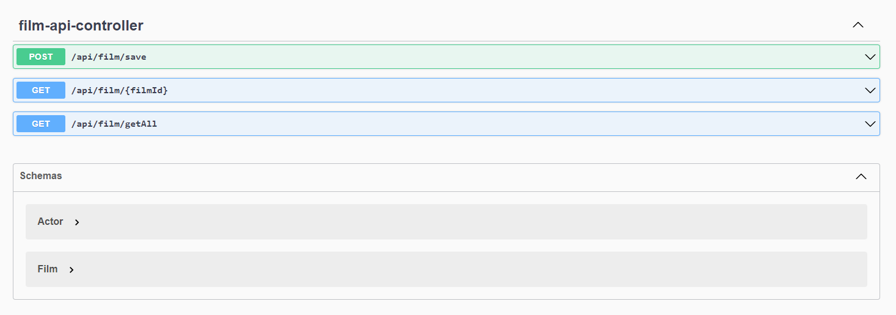

# Film API (Java Spring Boot)


Le Film API est une API Rest avec Java et Spring Boot
pour ajouter et obtenir les détails d'un film.

elle possedent 3 endpoints :

- Un GET pour obtenir un film par ID dans la base de données en mémoire (H2).
- Un GET pour obtenir l'ensemble des films dans la base de données en mémoire (H2).
- Un POST pour ajouter un film dans la base de données en mémoire (H2).


## Outils Utilisé

- Java 17
- Maven
- Spring Boot
- Spring Data
- Base de donnée en mémoire H2
- Lombok
- Mockito

l'application est equipé d'un swagger qui permet de faire des appels aux endpoint



## Modèle

#### Film

```
{
    "id": long,
    "tile": string,
    "description": string
    "actors": [
        {
            "id": long,
            "name": string,
            "lastName": string
        }
    ]
}
```

## Endpoints


#### GET /api/film/{id}

- Requête: ID dans l'URI
- Réponse: Objet List<Film>
- Status: 200 OK

```
http://localhost:8080/api/film/getAll
{
   "id":1,
   "title":"Star Wars: The Empire Strikes Back",
   "description":"Darth Vader is adamant about turning Luke Skywalker to the dark side.",
   "actors":[
      {
         "id":2,
         "name":"Ford",
         "lastName":"Harrison"
      },
      {
         "id":3,
         "name":"Hamill",
         "lastName":"Mark"
      }
   ]
}
```


#### GET /api/film/{id}

- Requête: ID dans l'URI
- Réponse: Objet Film
- Status: 200 OK

```
http://localhost:8080/api/film/1
{
   "id":1,
   "title":"Star Wars: The Empire Strikes Back",
   "description":"Darth Vader is adamant about turning Luke Skywalker to the dark side.",
   "actors":[
      {
         "id":2,
         "name":"Ford",
         "lastName":"Harrison"
      },
      {
         "id":3,
         "name":"Hamill",
         "lastName":"Mark"
      }
   ]
}
```

#### POST /api/film/save

- Requête: Objet Film dans le body
- Réponse: Objet Film crée
- Status: 201 CREATED

```
'{
   "title":"Star Wars: The Empire Strikes Back",
   "description":"Darth Vader is adamant about turning Luke Skywalker to the dark side.",
   "actors":[
      {
         "name":"Ford",
         "lastName":"Harrison"
      },
      {
         "name":"Hamill",
         "lastName":"Mark"
      }
   ]
}'
http://localhost:8080/api/film --header "Content-Type:application/json"

{
   "id":4,
   "title":"Star Wars: The Empire Strikes Back",
   "description":"Darth Vader is adamant about turning Luke Skywalker to the dark side.",
   "actors":[
      {
         "id":5,
         "name":"Ford",
         "lastName":"Harrison"
      },
      {
         "id":6,
         "name":"Hamill",
         "lastName":"Mark"
      }
   ]
}
```

## Tests

l'application est couvert par des test unitaire et d'integration


